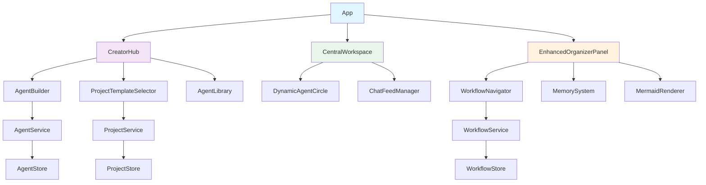

# BrainTrust Circle Brownfield Enhancement Architecture

**Project:** BrainTrust Circle - Flexible Agent System Enhancement  
**Version:** 1.0  
**Date:** February 8, 2025  
**Status:** Draft  

## Introduction

This document outlines the architectural approach for enhancing BrainTrust Circle with a flexible agent system, circular workflow navigation, and comprehensive customization capabilities. Its primary goal is to serve as the guiding architectural blueprint for AI-driven development of new features while ensuring seamless integration with the existing system.

**Relationship to Existing Architecture:**
This document supplements existing project architecture by defining how new components will integrate with current systems. Where conflicts arise between new and existing patterns, this document provides guidance on maintaining consistency while implementing enhancements.

### Existing Project Analysis

**Current Project State:**

- **Primary Purpose:** Multi-agent AI workspace with radial UI for intelligent conversations and task management
- **Current Tech Stack:** React 19.1.0, TypeScript 5.7.2, Vite 6.2.0, Zustand 5.0.6, Google Gemini API, Express 5.1.0, WebSocket
- **Architecture Style:** Component-based React architecture with service layer pattern and Zustand state management
- **Deployment Method:** Netlify for frontend, Node.js server for backend API

**Available Documentation:**

- ✅ Tech Stack Documentation (docs/architecture/tech-stack.md)
- ✅ Source Tree Structure (docs/architecture/source-tree.md)  
- ✅ Coding Standards (docs/architecture/coding-standards.md)
- ✅ Comprehensive Memory System (7 data types with Zustand persistence)
- ✅ Calendar Integration (auto-populated from memory data)
- ✅ Advanced Search & Analytics (multi-criteria with relevance scoring)

**Identified Constraints:**

- Must preserve existing memory system and conversation history
- Must maintain current UI interaction patterns (drag, resize, double-click)
- Must keep Organizer panel functionality intact
- Must support existing project management features
- Must maintain performance characteristics during agent switching
- Text-based agent storage preferred to avoid database complexity

## Enhancement Scope and Integration Strategy

**Enhancement Overview:**

- **Enhancement Type:** Major Feature Modification with New Feature Addition
- **Scope:** Transform hardcoded agent system into flexible, user-selectable agent library with workflow management
- **Integration Impact:** Significant - requires new components while preserving all existing functionality

**Integration Approach:**

- **Code Integration Strategy:** Extend existing components rather than replace, add new service layers for agent management
- **Database Integration:** Leverage existing Zustand persistence, add new stores for agents and workflows
- **API Integration:** Maintain Gemini integration, add OpenRouter support, prepare for local LLM integration
- **UI Integration:** Enhance existing 3-panel layout, add new components within current structure

**Compatibility Requirements:**

- **Existing API Compatibility:** Maintain all current Gemini service functionality
- **Database Schema Compatibility:** Extend Zustand stores without breaking existing data structures
- **UI/UX Consistency:** Preserve current interaction patterns while adding new capabilities
- **Performance Impact:** No degradation in current functionality, optimize new features for responsiveness

## Tech Stack Alignment

### Existing Technology Stack

| Category | Current Technology | Version | Usage in Enhancement | Notes |
|----------|-------------------|---------|---------------------|-------|
| Frontend Framework | React | 19.1.0 | Core UI components | Maintain existing patterns |
| Type System | TypeScript | 5.7.2 | All new components | Follow existing type definitions |
| Build Tool | Vite | 6.2.0 | Development and build | No changes needed |
| State Management | Zustand | 5.0.6 | Agent and workflow state | Extend existing stores |
| AI Integration | Google Gemini API | 1.9.0 | Maintain existing integration | Add multi-API support |
| Backend | Express | 5.1.0 | API endpoints | Extend for agent management |
| Real-time | WebSocket | 8.18.3 | Live communication | Maintain existing functionality |

### New Technology Additions

| Technology | Version | Purpose | Rationale | Integration Method |
|------------|---------|---------|-----------|-------------------|
| OpenRouter API | Latest | Multi-model AI access | Provide model diversity beyond Gemini | Service layer abstraction |
| Electron | Latest | Desktop version | Local LLM integration requirement | Wrapper around existing React app |
| Mermaid | Latest | Visual diagram rendering | Agent workflow visualization | Component integration |
| Docker | Latest | Code sandbox isolation | Safe code execution environment | Container-based sandbox service |

## Data Models and Schema Changes

### New Data Models

#### Agent Model

**Purpose:** Define flexible agent configurations with customization capabilities  
**Integration:** Extends existing agent system, replaces hardcoded AGENTS constant

**Key Attributes:**

- id: string - Unique identifier for agent
- name: string - Display name for agent
- role: string - Agent's specialized role
- description: string - Detailed agent description
- systemInstruction: string - AI system prompt
- color: string - Visual theme color
- avatar: string - Display icon/emoji
- specializedSkills: string[] - List of agent capabilities
- category: string - Agent category for organization
- tags: string[] - Searchable tags
- isTemplate: boolean - Whether agent is a template
- knowledgeFiles: File[] - Uploaded knowledge documents
- customImage: string | null - Custom avatar image
- createdBy: string - Creator identifier

**Relationships:**

- **With Existing:** Integrates with current Agent interface, maintains compatibility with chat system
- **With New:** Related to ProjectTemplate, WorkflowStage models

#### ProjectTemplate Model

**Purpose:** Pre-configured project setups with agent teams and workflows  
**Integration:** New system for project creation, integrates with existing project management

**Key Attributes:**

- id: string - Unique template identifier
- name: string - Template display name
- description: string - Template description
- category: string - Template category (Creative, Business, Technical, etc.)
- defaultAgents: Agent[] - Pre-selected agent team
- theme: ProjectTheme - Visual customization
- welcomeMessage: string - Initial project message
- feedHeadline: string - Custom chat feed headline
- templateWorkflow: Workflow - Template-specific workflow with custom stages
- workflowAgents: Record<string, Agent[]> - Stage-specific agent assignments
- isPublic: boolean - Community sharing flag
- createdBy: string - Template creator
- usageCount: number - Usage statistics
- rating: number - Community rating

**Relationships:**

- **With Existing:** Integrates with current project creation system
- **With New:** Contains Agent and Workflow references

#### Workflow Model

**Purpose:** Structured process management with circular navigation  
**Integration:** New workflow system, integrates with existing Organizer functionality

**Key Attributes:**

- id: string - Workflow identifier
- name: string - Workflow name
- type: 'bmad' | 'creative-writing' | 'film-production' | 'small-business' | 'custom' - Workflow category
- stages: WorkflowStage[] - Template-specific workflow stages
- isCircular: boolean - Whether workflow loops back to start
- stageColors: Record<string, string> - Template-defined color coding for stages
- stageAbbreviations: Record<string, string> - Template-defined short labels

**Relationships:**

- **With Existing:** Integrates with Organizer panel and memory system
- **With New:** Contains WorkflowStage references, used by ProjectTemplate

#### WorkflowStage Model

**Purpose:** Individual stages within workflows that influence the single shared chat feed  
**Integration:** Integrates with existing single chat feed system, provides context for agent responses

**Key Attributes:**

- id: string - Stage identifier
- name: string - Stage display name
- abbreviation: string - Short label for circular UI (PLAN, ARCH, STORY, DEV, REV)
- color: string - Stage color coding for circular navigation
- stageContext: string - Context provided to agents when this stage is active
- suggestedAgents: string[] - Recommended agents for this stage
- stagePrompts: string[] - Suggested conversation starters for this stage

**Relationships:**

- **With Existing:** Influences the single existing chat feed with stage-aware context
- **With New:** Part of Workflow, provides context to Agent responses in shared feed

#### UITheme Model

**Purpose:** User interface customization and theming system  
**Integration:** Extends existing UI system with customizable themes and color palettes

**Key Attributes:**

- id: string - Theme identifier
- name: string - Theme display name
- primaryColor: string - Main theme color
- secondaryColor: string - Accent color
- backgroundColor: string - Background color
- textColor: string - Primary text color
- panelColor: string - Panel background color
- borderColor: string - Border and divider color
- agentColors: Record<string, string> - Custom colors for different agent types
- isDefault: boolean - Whether this is a default theme
- isCustom: boolean - Whether this is user-created
- createdBy: string - Theme creator

**Relationships:**

- **With Existing:** Applies to all existing UI components and panels
- **With New:** Used by ProjectTemplate for project-specific themes

### Comprehensive Store Architecture

#### Core Data Stores

- **memoryStore.ts** - Existing comprehensive memory system (tasks, goals, decisions, insights, projects, conversations, summaries)
- **agentStore.ts** - Agent library, custom agents, agent configurations, agent performance metrics
- **workflowStore.ts** - Workflow definitions, current workflow state, stage progress, workflow history
- **templateStore.ts** - Project templates, agent templates, community templates, template usage stats
- **projectStore.ts** - Current project state, project settings, project metadata, project history

#### User Experience Stores

- **chatStore.ts** - Chat state, message history, active conversations, conversation context
- **themeStore.ts** - UI themes, color palettes, user customizations, theme preferences
- **userStore.ts** - User preferences, settings, authentication state, user profile
- **uiStore.ts** - Panel states, modals, loading states, UI interactions, layout preferences

#### Content & File Management Stores

- **fileStore.ts** - Uploaded files, file metadata, file processing status, file history
- **sandboxStore.ts** - Code execution history, sandbox sessions, execution results, code snippets
- **searchStore.ts** - Search history, filters, search preferences, search results cache

#### Integration & External Stores

- **apiStore.ts** - API configurations, keys, provider settings, rate limits, API health
- **extensionStore.ts** - Browser extension state, external AI connections, integration status
- **communityStore.ts** - Shared templates, ratings, community content, sharing preferences
- **desktopStore.ts** - Desktop-specific settings, local LLM configurations, offline capabilities

#### System & Performance Stores

- **notificationStore.ts** - System notifications, alerts, status messages, notification preferences
- **analyticsStore.ts** - Usage analytics, performance metrics, user behavior, system health
- **cacheStore.ts** - Cached data, temporary storage, performance optimization, cache management
- **syncStore.ts** - Data synchronization, backup status, cloud sync, data integrity

### Schema Integration Strategy

**Database Changes Required:**

- **New Tables:** None (using Zustand local storage with persistence)
- **Modified Tables:** Extend existing memoryStore, add 18 new specialized stores
- **New Indexes:** None required for local storage
- **Migration Strategy:** Gradual store addition with backward compatibility

**Store Relationships:**

- **memoryStore** ↔ **projectStore** - Project-specific memory isolation
- **agentStore** ↔ **templateStore** - Agent templates and configurations
- **workflowStore** ↔ **chatStore** - Workflow-aware conversation context
- **fileStore** ↔ **sandboxStore** - Code file execution and results
- **themeStore** ↔ **uiStore** - Theme application and UI state
- **apiStore** ↔ **extensionStore** - External service integration
- **communityStore** ↔ **templateStore** - Community template sharing

**Backward Compatibility:**

- Existing memoryStore structure preserved completely
- New stores added alongside existing ones
- Existing conversation history and projects remain intact
- Current agent system maintained until replacement is complete

## Component Architecture

### CRITICAL: Single Chat Feed Architecture

**Core Principle:** There is ONE central chat feed for normal conversations, PLUS workflow-specific feeds when using structured workflows. This provides both simplicity and advanced workflow capabilities.

**MAJOR CHANGE: Remove Hardcoded Agents**

- **REMOVE:** Hardcoded Designer, Developer, Engineer agents from constants.tsx
- **REPLACE WITH:** Dynamic agent selection system where users choose their own agents
- **MAINTAIN:** Organizer as the only permanent agent (cannot be removed)
- **NEW SYSTEM:** Users select agents from library or create custom agents for each project

**Agent Interaction System:**

1. **Agent Selection:** Users choose agents from library when creating projects
2. **Radial Positioning:** Selected agents appear in radial circle around chat feed
3. **Mouse Interaction:** Click and drag agents to move them around the circle
4. **Double-Click Bio:** Double-click any agent to see their bio/description popup
5. **Edit Button:** Bio popup includes "Edit" button to modify agent
6. **Agent Builder:** Edit button opens full agent builder with template system
7. **Knowledge Upload:** Agent builder allows uploading knowledge files for specialization

**User Interaction Flow:**

**Normal Mode (Single Feed):**
1. User types message or uploads content into the central chat feed
2. User clicks on any agent in the radial circle
3. User asks "what do you think about that?" or similar
4. Selected agent responds with their perspective
5. Conversation continues in the same central feed

**Workflow Mode (Template-Specific Multi-Feed):**
1. User clicks on a circular workflow arrow (stages vary by project template)
2. System opens a **dedicated feed for that workflow stage**
3. Feed loads with **stage-specific agents** defined by the project template
4. User works within that workflow stage with template-appropriate agents
5. User can switch between workflow stages, each with its own dedicated feed
6. Organizer maintains context and progress across all workflow feeds

**Template-Specific Workflow Examples:**

**Software Product Business Template (Concrete Implementation):**
- **RESEARCH** (Blue) → Market Research Team: Market Analyst, User Researcher, Competitor Analyst
- **STRATEGY** (Green) → Strategy Team: Product Strategist, Business Model Expert, Pricing Specialist
- **MARKETING** (Yellow) → Marketing Team: Marketing Manager, Content Creator, Social Media Expert
- **LAUNCH** (Orange) → Launch Team: Launch Coordinator, Sales Specialist, Partnership Manager
- **GROWTH** (Red) → Growth Team: Growth Hacker, Analytics Expert, Customer Success Manager

*Each stage understands this is for software products and provides software-specific business guidance*

**Other Template Examples:**
- **Creative Writing:** Brainstorm → Draft → Edit → Review → Publish
- **Film Production:** Script → Pre-Prod → Production → Post → Distribution  
- **Software Development:** Plan → Arch → Story → Dev → Review (BMad workflow)
- **Small Business:** Research → Plan → Launch → Market → Scale

**Content Support:**

- **Rich File Upload:** Images, markdown files, PDFs, documents upload directly into chat
- **Code Sandbox Integration:** Upload and execute code snippets safely in isolated environment
- **Visual Rendering:** Mermaid diagrams, images, formatted markdown display inline
- **Code Execution Results:** Live code output and error handling displayed in chat
- **External AI Integration:** ChatGPT, Grok, DeepSeek responses appear in same feed
- **Workflow Context:** Current workflow stage provides context to all agent responses

**Technical Implementation:**

- **REMOVE hardcoded AGENTS constant** from constants.tsx
- Replace with dynamic agent loading system
- **Create ChatFeedManager** to handle both single feed and workflow-specific feeds
- **Normal Mode:** Single central chat feed for regular conversations
- **Workflow Mode:** Dedicated feeds for each template-specific workflow stage
- Add agent selection interface to project creation
- Implement drag-and-drop agent positioning in radial UI
- Add double-click handler for agent bio popup with edit button
- **Template-Specific Circular Navigation:** Clicking workflow arrows switches to stage-specific feeds based on project template
- **Template-Defined Agent Loading:** Each workflow feed loads agents defined by the project template for that stage
- Integrate agent builder with knowledge file upload
- Add file upload capabilities to all chat feeds
- Enhance message rendering for rich content
- **Context Preservation:** Organizer maintains context across all workflow feeds
- Maintain conversation history for both normal and workflow feeds

### New Components

#### AgentBuilder Component

**Responsibility:** Comprehensive visual interface for creating and editing custom agents  
**Integration Points:** Creator Hub panel, agent double-click edit buttons, agent bio popups

**Key Interfaces:**

- AgentBuilderProps: isOpen, onClose, editingAgent, onSave
- **Resizable Card Interface:** Like ChatFeed - can minimize/maximize, drag to resize
- **Template System:** Pre-built agent templates (creative writer, technical expert, spiritual guru, etc.)
- **Deep Prompt Editing:** Full system instruction editor with syntax highlighting
- **Knowledge Upload:** Upload PDFs, documents, markdown files for agent specialization
- **Visual Customization:** Colors, avatars, patterns, custom images, titles
- **Specialized Skills:** Define agent capabilities and expertise areas
- **Bio/Description Editor:** Rich text editor for agent descriptions
- **Preview Mode:** Test agent responses before saving

**Access Methods:**

- **Creator Hub:** Click "Agent Builder" in left panel
- **Agent Edit:** Double-click agent → bio popup → "Edit" button → opens builder
- **Template Creation:** "Create Template" option for sharing custom agents

**Dependencies:**

- **Existing Components:** Integrates with current modal/overlay system, follows ChatFeed resizing patterns
- **New Components:** AgentTemplateSelector, KnowledgeUploader, PromptEditor, AgentPreview
- **Technology Stack:** React, TypeScript, Monaco Editor for prompts, file upload APIs

#### WorkflowNavigator Component

**Responsibility:** Circular workflow stage navigation that influences the single shared chat feed  
**Integration Points:** Organizer panel, provides context to existing chat feed

**Key Interfaces:**

- WorkflowNavigatorProps: workflow, currentStage, onStageChange
- Circular interlocking arrow rendering with color coding
- Stage context injection into single chat feed
- Progress indication and completion status

**Dependencies:**

- **Existing Components:** Integrates with Organizer panel and existing ChatFeed
- **New Components:** CircularArrowStage, StageIndicator
- **Technology Stack:** React, TypeScript, SVG/CSS for interlocking circular design

#### ProjectTemplateSelector Component

**Responsibility:** Template browsing and project creation interface  
**Integration Points:** Creator Hub panel, new project workflow

**Key Interfaces:**

- ProjectTemplateSelectorProps: templates, onSelect, onCreateNew
- Template preview with agent roster display
- Category filtering and search
- Progressive setup wizard

**Dependencies:**

- **Existing Components:** Integrates with current project creation
- **New Components:** TemplatePreview, AgentRoster
- **Technology Stack:** React, TypeScript, existing project management

#### CreatorHub Component

**Responsibility:** Comprehensive left panel for all creation and customization features  
**Integration Points:** Main application layout, replaces current left panel

**Complete Feature List:**

- **New Project Options:**
  - New Project (blank slate with agent selection)
  - From Template (browse project templates with pre-configured agent teams)
  - Create Template (build custom project templates for sharing)
  - Simple Chat (quick agent selection without full project setup)

- **Agent Management:**
  - Agent Library (browse/search 50+ specialized agents by category)
  - Agent Builder (create/edit custom agents with resizable card interface)
  - My Creations (user's custom agents and templates)
  - Agent Templates (creative writer, technical expert, spiritual guru, movie script team, etc.)

- **Template System:**
  - Template Library (browse project templates by category: Creative, Business, Technical, Spiritual)
  - Template Builder (create custom project templates with agent rosters and workflows)
  - Community Templates (shared templates from other users with ratings)

- **UI Customization:**
  - UI Customizer (color palettes, themes, visual customization)
  - Theme Library (preset themes: dark, light, custom palettes)
  - Export/Import Themes (share custom themes)

- **Future Features:**
  - Social Media Connections
  - Community Marketplace
  - Agent Sharing and Discovery

**Key Interfaces:**

- CreatorHubProps: currentProject, onProjectChange, onAgentCreate, onTemplateSelect
- Progressive project setup wizard with non-overwhelming interface
- Agent selection with visual feedback and drag-and-drop
- Template preview with agent roster display
- Theme customization with live preview

**Dependencies:**

- **Existing Components:** Replaces/enhances existing left panel
- **New Components:** AgentBuilder, ProjectTemplateSelector, AgentLibrary, UICustomizer, TemplateBuilder
- **Technology Stack:** React, TypeScript, existing panel system

#### EnhancedChatFeed Component

**Responsibility:** Enhanced single chat feed with rich content support and file uploads  
**Integration Points:** Central workspace, extends existing ChatFeed component

**Key Interfaces:**

- EnhancedChatFeedProps: messages, onSendMessage, onFileUpload, currentWorkflowStage
- File upload integration (images, markdown, PDFs, documents)
- Rich content rendering (Mermaid, images, formatted text)
- Workflow stage context awareness
- Agent response routing and display

**Dependencies:**

- **Existing Components:** Extends current ChatFeed component
- **New Components:** FileUploader, ContentRenderer, MermaidRenderer
- **Technology Stack:** React, TypeScript, file handling APIs, Mermaid

#### FileUploader Component

**Responsibility:** Handle multiple file type uploads for the single chat feed  
**Integration Points:** Enhanced chat input area

**Key Interfaces:**

- FileUploaderProps: onFileUpload, acceptedTypes, maxSize
- Support for images (PNG, JPG, GIF, SVG)
- Support for documents (PDF, DOC, DOCX, TXT, MD)
- Support for code files (JS, TS, PY, HTML, CSS, JSON, etc.)
- Drag-and-drop functionality
- File preview and validation

**Dependencies:**

- **Existing Components:** Integrates with chat input system
- **New Components:** FilePreview, FileValidator, CodeSandbox
- **Technology Stack:** React, File API, drag-and-drop handlers

#### CodeSandbox Component

**Responsibility:** Safe code execution environment integrated into the chat feed  
**Integration Points:** Chat message rendering, code file uploads

**Key Interfaces:**

- CodeSandboxProps: code, language, onExecute, onResult
- Support for multiple languages (JavaScript, TypeScript, Python, HTML/CSS)
- Docker-based isolated execution environment
- Real-time output display and error handling
- Code editing capabilities within chat

**Dependencies:**

- **Existing Components:** Integrates with chat message system
- **New Components:** CodeEditor, DockerExecutionEnvironment, OutputRenderer
- **Technology Stack:** Monaco Editor, Docker containers, sandboxed execution

#### UICustomizer Component

**Responsibility:** User interface theme and color palette customization  
**Integration Points:** Creator Hub panel, user settings

**Key Interfaces:**

- UICustomizerProps: currentTheme, onThemeChange, presetPalettes
- Color palette selection and custom color picker
- Theme preview with live updates
- Preset theme library (dark, light, custom palettes)
- Export/import custom themes

**Dependencies:**

- **Existing Components:** Integrates with Creator Hub layout
- **New Components:** ColorPicker, ThemePreview, PaletteSelector
- **Technology Stack:** React, CSS custom properties, color manipulation utilities

#### EnhancedOrganizerPanel Component

**Responsibility:** Enhanced right panel with workflow navigation and advanced features  
**Integration Points:** Main application layout, extends current Organizer panel

**Key Interfaces:**

- EnhancedOrganizerPanelProps: project, workflow, memoryData, onWorkflowChange
- Workflow Navigator integration
- Mermaid diagram display
- Enhanced memory and analytics features

**Dependencies:**

- **Existing Components:** Extends current OrganizerPanel
- **New Components:** WorkflowNavigator, MermaidRenderer
- **Technology Stack:** React, TypeScript, Mermaid, existing memory system

### Component Interaction Diagram



## API Design and Integration

### API Integration Strategy

**API Integration Strategy:** Extend existing service layer with new agent and workflow services  
**Authentication:** Maintain existing authentication patterns, extend for new services  
**Versioning:** No versioning needed for internal APIs, maintain external API compatibility

### New API Endpoints

#### Agent Management Endpoints

- **Method:** GET
- **Endpoint:** `/api/agents`
- **Purpose:** Retrieve available agents from library
- **Integration:** Extends existing API structure

**Request:**

```json
{
  "category": "string",
  "tags": ["string"],
  "search": "string"
}
```

**Response:**

```json
{
  "agents": [
    {
      "id": "string",
      "name": "string",
      "role": "string",
      "description": "string",
      "category": "string",
      "tags": ["string"],
      "color": "string",
      "avatar": "string"
    }
  ],
  "total": "number"
}
```

#### Project Template Endpoints

- **Method:** GET
- **Endpoint:** `/api/templates`
- **Purpose:** Retrieve project templates
- **Integration:** New endpoint following existing API patterns

**Request:**

```json
{
  "category": "string",
  "public": "boolean"
}
```

**Response:**

```json
{
  "templates": [
    {
      "id": "string",
      "name": "string",
      "description": "string",
      "category": "string",
      "defaultAgents": ["string"],
      "theme": "object",
      "usageCount": "number",
      "rating": "number"
    }
  ]
}
```

#### Code Sandbox Endpoints

- **Method:** POST
- **Endpoint:** `/api/sandbox/execute`
- **Purpose:** Execute code safely in sandbox environment
- **Integration:** New endpoint for code execution capabilities

**Request:**

```json
{
  "code": "string",
  "language": "javascript|typescript|python|html",
  "timeout": "number",
  "dependencies": ["string"]
}
```

**Response:**

```json
{
  "success": "boolean",
  "output": "string",
  "error": "string",
  "executionTime": "number",
  "memoryUsage": "number"
}
```

## External API Integration

### MCP (Model Context Protocol) Integration

- **Purpose:** Extend platform capabilities with custom tools and external services
- **Configuration:** .kiro/settings/mcp.json for server management
- **Current Servers:** brave-search (web search), bmad-local (BMad agents)
- **Integration Method:** Tool discovery and loading system with secure execution

**MCP Server Configuration:**

```json
{
  "mcpServers": {
    "brave-search": {
      "command": "uvx",
      "args": ["brave-search-mcp-server"],
      "disabled": false,
      "autoApprove": ["search"]
    },
    "bmad-local": {
      "command": "node",
      "args": ["bmad-mcp-server.js"],
      "disabled": false,
      "autoApprove": []
    }
  }
}
```

**Key Features:**

- Dynamic tool loading and auto-approval settings
- Integration with existing agent system for tool access
- Tool discovery and management interface
- Secure tool execution with user permission controls
- Support for community MCP servers and custom tools

**Error Handling:** Tool availability checking, graceful fallbacks when MCP servers unavailable

### OpenRouter API

- **Purpose:** Multi-model AI access for diverse agent capabilities
- **Documentation:** <https://openrouter.ai/docs>
- **Base URL:** <https://openrouter.ai/api/v1>
- **Authentication:** Bearer token authentication
- **Integration Method:** Service layer abstraction with fallback to Gemini

**Setup Requirements (USER ACTION REQUIRED):**

1. Create account at <https://openrouter.ai/>
2. Generate API key from dashboard
3. Add API key to environment variables as `OPENROUTER_API_KEY`
4. Configure API key in application settings

**Key Endpoints Used:**

- `POST /chat/completions` - AI conversation processing
- `GET /models` - Available model listing

**Error Handling:** Graceful fallback to Gemini API, user notification of service issues

### Local LLM Integration (Desktop Version)

- **Purpose:** Offline AI capabilities for desktop version
- **Documentation:** Custom local API service
- **Base URL:** <http://localhost:8080/api>
- **Authentication:** Local authentication tokens
- **Integration Method:** Desktop-specific service adapter

**Key Endpoints Used:**

- `POST /chat` - Local model conversation
- `GET /models` - Available local models
- `POST /models/load` - Load specific model

**Error Handling:** Model loading status, memory management, fallback to cloud APIs

## Source Tree Integration

### Existing Project Structure

```
BrainTrust_circle-main/
├── components/              # React components
│   ├── AdminAssistant.tsx
│   ├── Calendar.tsx
│   ├── ChatFeed.tsx
│   ├── MemorySearch.tsx
│   ├── MemoryStats.tsx
│   ├── OrganizerPanel.tsx
│   └── TaskSidebar.tsx
├── services/                # API and business logic
│   ├── geminiService.ts
│   └── agentService.ts
├── stores/                  # Zustand state management
│   └── memoryStore.ts
├── docs/                    # Documentation
│   └── architecture/
└── types.ts                 # TypeScript definitions
```

### New File Organization

```
BrainTrust_circle-main/
├── components/
│   ├── agent/               # Agent-related components
│   │   ├── AgentBuilder.tsx
│   │   ├── AgentLibrary.tsx
│   │   ├── AgentCard.tsx
│   │   └── KnowledgeUploader.tsx
│   ├── workflow/            # Workflow components
│   │   ├── WorkflowNavigator.tsx
│   │   ├── WorkflowStage.tsx
│   │   └── CircularArrows.tsx
│   ├── templates/           # Template components
│   │   ├── ProjectTemplateSelector.tsx
│   │   ├── TemplateBuilder.tsx
│   │   └── TemplatePreview.tsx
│   ├── panels/              # Enhanced panel components
│   │   ├── CreatorHub.tsx
│   │   └── EnhancedOrganizerPanel.tsx
│   └── visual/              # Visual content components
│       ├── MermaidRenderer.tsx
│       └── ImageUploader.tsx
├── services/
│   ├── agentManagementService.ts    # Agent CRUD operations
│   ├── workflowService.ts           # Workflow management
│   ├── templateService.ts           # Template operations
│   ├── openRouterService.ts         # OpenRouter API integration
│   ├── localLLMService.ts           # Desktop local LLM service
│   ├── dockerSandboxService.ts      # Docker-based code execution
│   ├── themeService.ts              # UI theme management
│   └── fileProcessingService.ts     # File upload and processing
├── stores/
│   ├── memoryStore.ts              # Existing: tasks, goals, decisions, insights, projects, conversations, summaries
│   ├── agentStore.ts               # Agent library, custom agents, agent configurations
│   ├── workflowStore.ts            # Workflow definitions, current workflow state, stage progress
│   ├── templateStore.ts            # Project templates, agent templates, community templates
│   ├── themeStore.ts               # UI themes, color palettes, user customizations
│   ├── projectStore.ts             # Current project, project settings, project metadata
│   ├── chatStore.ts                # Chat state, message history, active conversations
│   ├── fileStore.ts                # Uploaded files, file metadata, file processing status
│   ├── sandboxStore.ts             # Code execution history, sandbox sessions, execution results
│   ├── apiStore.ts                 # API configurations, keys, provider settings, rate limits
│   ├── userStore.ts                # User preferences, settings, authentication state
│   ├── communityStore.ts           # Shared templates, ratings, community content
│   ├── extensionStore.ts           # Browser extension state, external AI connections
│   ├── desktopStore.ts             # Desktop-specific settings, local LLM configurations
│   ├── notificationStore.ts        # System notifications, alerts, status messages
│   ├── searchStore.ts              # Search history, filters, search preferences
│   ├── analyticsStore.ts           # Usage analytics, performance metrics, user behavior
│   ├── cacheStore.ts               # Cached data, temporary storage, performance optimization
│   ├── syncStore.ts                # Data synchronization, backup status, cloud sync
│   └── uiStore.ts                  # Panel states, modals, loading states, UI interactions
├── types/
│   ├── agent.ts                    # Agent-related types
│   ├── workflow.ts                 # Workflow types
│   ├── template.ts                 # Template types
│   └── index.ts                    # Type exports
└── utils/
    ├── agentValidation.ts          # Agent configuration validation
    ├── workflowEngine.ts           # Workflow execution logic
    ├── templateProcessor.ts        # Template processing utilities
    ├── codeValidator.ts            # Code safety validation
    └── sandboxManager.ts           # Sandbox environment management
```

### Integration Guidelines

- **File Naming:** Follow existing camelCase for components, kebab-case for utilities
- **Folder Organization:** Group by feature/domain, maintain existing structure patterns
- **Import/Export Patterns:** Use barrel exports, maintain existing import conventions

## Infrastructure and Deployment Integration

### Existing Infrastructure

**Current Deployment:** Netlify for frontend static hosting, separate Node.js server for backend  
**Infrastructure Tools:** Vite build system, npm package management, Git-based deployment  
**Environments:** Development (local), Production (Netlify + Node.js server)

### Enhancement Deployment Strategy

**Deployment Approach:** Maintain existing Netlify deployment, extend backend services with Docker containers  
**Infrastructure Changes:** Add Docker container orchestration for code sandbox execution  
**Pipeline Integration:** Use existing build process, add Docker container builds and deployment

### Rollback Strategy

**Rollback Method:** Git-based rollback with feature flags for new components  
**Risk Mitigation:** Gradual rollout of new features, maintain existing functionality during transition  
**Monitoring:** Extend existing error tracking, add performance monitoring for new components

## Coding Standards and Conventions

### Existing Standards Compliance

**Code Style:** TypeScript strict mode, ESLint configuration, Prettier formatting  
**Linting Rules:** Existing ESLint rules for React/TypeScript, accessibility compliance  
**Testing Patterns:** React Testing Library for component tests, unit tests for services  
**Documentation Style:** JSDoc comments, README documentation, inline code comments

### Enhancement-Specific Standards

- **Agent Configuration:** YAML/JSON schema validation for agent definitions
- **Workflow Definition:** Structured workflow schema with validation
- **Component Props:** Strict TypeScript interfaces for all new components
- **Service Layer:** Consistent error handling and response patterns
- **State Management:** Zustand patterns consistent with existing stores

### Critical Integration Rules

- **Existing API Compatibility:** All existing API endpoints must remain functional
- **Database Integration:** New Zustand stores must not interfere with existing stores
- **Error Handling:** Consistent error boundaries and user feedback patterns
- **Logging Consistency:** Use existing logging patterns, extend for new features

## Testing Strategy

### Integration with Existing Tests

**Existing Test Framework:** React Testing Library, Jest, TypeScript  
**Test Organization:** Tests co-located with components, separate test utilities  
**Coverage Requirements:** Maintain existing coverage levels, aim for 80%+ on new features

### New Testing Requirements

#### Unit Tests for New Components

- **Framework:** React Testing Library + Jest (existing)
- **Location:** Adjacent to component files (existing pattern)
- **Coverage Target:** 80%+ for new components
- **Integration with Existing:** Use existing test utilities and patterns

#### Integration Tests

- **Scope:** Agent creation workflow, template system, workflow navigation
- **Existing System Verification:** Ensure existing memory system, calendar, search remain functional
- **New Feature Testing:** End-to-end workflows for agent creation and project templates

#### Regression Tests

- **Existing Feature Verification:** Automated tests for all existing functionality
- **Automated Regression Suite:** Extend existing test suite with new integration points
- **Manual Testing Requirements:** User acceptance testing for new UI components

## Security Integration

### Existing Security Measures

**Authentication:** Current user authentication system (if any)  
**Authorization:** Existing permission patterns  
**Data Protection:** Local storage encryption, secure API communication  
**Security Tools:** Existing security scanning and validation

### Enhancement Security Requirements

**New Security Measures:** Agent configuration validation, template sharing security, code sandbox isolation  
**Integration Points:** Secure knowledge file upload, external API key management, safe code execution  
**Compliance Requirements:** Data privacy for user-created agents and templates, code execution safety

### Security Testing

**Existing Security Tests:** Maintain current security test coverage  
**New Security Test Requirements:** Agent configuration validation, file upload security, code sandbox isolation  
**Penetration Testing:** Security review of new API endpoints, file handling, and code execution environment

## Next Steps

### Story Manager Handoff

The architecture is now complete and ready for story creation. The Story Manager should:

- Reference this architecture document for technical guidance
- Focus on UI-first development approach as outlined in existing tasks.md
- Maintain integration with existing memory system, calendar, and search functionality
- Implement agent builder as resizable card interface (like existing ChatFeed)
- Ensure circular workflow navigation follows interlocking arrow design
- Preserve all existing functionality while adding new capabilities
- Start with Phase 1 tasks: UI Foundation & Visual Structure

### Developer Handoff

Developers beginning implementation should:

- Follow existing React/TypeScript patterns and coding standards
- Extend existing Zustand stores rather than replacing them
- Maintain backward compatibility with existing conversation history and projects
- Use existing component patterns for new UI elements
- Integrate new services with existing API structure
- Test thoroughly to ensure existing functionality remains intact
- Implement progressive enhancement to avoid overwhelming users

**Key Technical Decisions Based on Project Analysis:**

- Text-based agent storage (YAML/JSON) to avoid database complexity
- Extend existing Zustand stores for state management
- Maintain existing 3-panel layout while enhancing functionality
- Use existing React component patterns for consistency
- Preserve existing memory system and calendar integration
- Follow existing API patterns for new endpoints

**Implementation Sequence:**

1. Start with UI foundation (Creator Hub, enhanced Organizer Panel)
2. Implement agent builder with existing modal/card patterns
3. Add workflow navigation with circular arrow design
4. Integrate with existing memory and project systems
5. Add multi-API support and external integrations
6. Implement community features and desktop version

This architecture ensures seamless integration with your existing BrainTrust Circle system while providing the flexibility and extensibility you need for the enhanced agent system.
