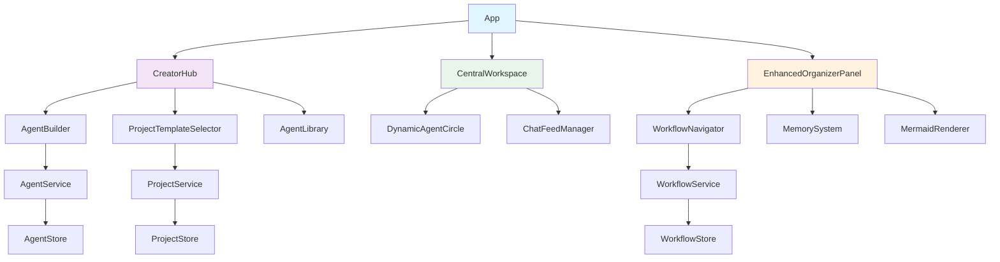

# Component Architecture

## CRITICAL: Single Chat Feed Architecture

**Core Principle:** There is ONE central chat feed where ALL conversations happen. This is fundamental to the user experience.

**MAJOR CHANGE: Remove Hardcoded Agents BUT USE THER BUILD ON THE DESIGH. ONE ORGANIZER THE DYNAMIC SUPER INTERACTIVE AGENT ASSISTANT TO THR USER AND ONE DIMENTIONAL HYPER FOCUSED ON RLE SPECALISTS THAT HAVE MULTI ORGANIZER DATA BASE OF SPECALISTS AND TEAM TEMPLATES FOR INDUSTRY SIMULATING AND WORKFLOW STAGES  THAT FIT THE PROJECT FOCUS LIKE BUISNES FOR START-UPS SOPTWARE SERVICES AND PRODUCT...**

- **REMOVE:** Hardcoded Designer, Developer, Engineer agents from constants.tsx AND LEAVE THE ORGANIZER FOR ALWAYS! 
- **REPLACE WITH:** Dynamic agent selection system where users choose their own agents OR CREATE SPECALISTS  IN THE CREATOR HUB, USERS CAN SHARE THERE CREATIONS AND TEAM TEMPLATES WITH THE COMMUNITY.
- **MAINTAIN:** Organizer as the only permanent agent (cannot be removed)
- **NEW SYSTEM:** Users select agents from library or create custom agents for each project

**Agent Interaction System:**

1. **Agent Selection:** Users choose agents from library when creating projects
2. **Radial Positioning:** Selected agents appear in radial circle around chat feed
3. **Mouse Interaction:** Click and drag agents to move them around the circle
4. **Double-Click Bio:** Double-click any agent to see their bio/description popup USE THE EXISTING DESIGHN TO START? 
5. **Edit Button:** Bio popup includes "Edit" button to modify agent
6. **Agent Builder:** Edit button opens full agent builder with template system
7. **Knowledge Upload:** Agent builder allows uploading knowledge files for specialization

**User Interaction Flow:**

1. User types message or uploads content (images, markdown, PDFs, documents) into the single chat feed
2. User clicks on any agent in the radial circle OR clicks workflow stage
3. User asks "what do you think about that?" or similar
4. Selected agent responds with their specific perspective/expertise based on their custom configuration
5. Conversation continues in the same single feed with different agents contributing

**Content Support:**

- **Rich File Upload:** Images, markdown files, PDFs, documents upload directly into chat
- **Code Sandbox Integration:** Upload and execute code snippets safely in isolated environment
- **Visual Rendering:** Mermaid diagrams, images, formatted markdown display inline
- **Code Execution Results:** Live code output and error handling displayed in chat
- **External AI Integration:** ChatGPT, Grok, DeepSeek responses appear in same feed
- **Workflow Context:** Current workflow stage provides context to all agent responses

**Technical Implementation:**

- **REMOVE hardcoded AGENTS constant** from constants.tsx
- Replace with dynamic agent loading system
- Extend existing ChatFeed component (do NOT create multiple feeds)
- Add agent selection interface to project creation
- Implement drag-and-drop agent positioning in radial UI
- Add double-click handler for agent bio popup with edit button
- Integrate agent builder with knowledge file upload
- Add file upload capabilities to existing chat input
- Enhance message rendering for rich content
- Add workflow stage context to agent prompts
- Maintain single conversation history in existing memory system

## New Components

### AgentBuilder Component

**Responsibility:** Comprehensive visual interface for creating and editing custom agents  
**Integration Points:** Creator Hub panel, agent double-click edit buttons, agent bio popups

**Key Interfaces:**

- AgentBuilderProps: isOpen, onClose, editingAgent, onSave
- **Resizable Card Interface:** Like ChatFeed - can minimize/maximize, drag to resize
- **Template System:** Pre-built agent templates (creative writer, technical expert, spiritual guru, etc.)
- **Deep Prompt Editing:** Full system instruction editor with syntax highlighting
- **Knowledge Upload:** Upload PDFs, documents, markdown files for agent specialization
- **Visual Customization:** Colors, avatars, patterns, custom images, titles
- **Specialized Skills:** Define agent capabilities and expertise areas
- **Bio/Description Editor:** Rich text editor for agent descriptions
- **Preview Mode:** Test agent responses before saving

**Access Methods:**

- **Creator Hub:** Click "Agent Builder" in left panel
- **Agent Edit:** Double-click agent → bio popup → "Edit" button → opens builder
- **Template Creation:** "Create Template" option for sharing custom agents

**Dependencies:**

- **Existing Components:** Integrates with current modal/overlay system, follows ChatFeed resizing patterns
- **New Components:** AgentTemplateSelector, KnowledgeUploader, PromptEditor, AgentPreview
- **Technology Stack:** React, TypeScript, Monaco Editor for prompts, file upload APIs

### WorkflowNavigator Component

**Responsibility:** Circular workflow stage navigation that influences the single shared chat feed  
**Integration Points:** Organizer panel, provides context to existing chat feed

**Key Interfaces:**

- WorkflowNavigatorProps: workflow, currentStage, onStageChange
- Circular interlocking arrow rendering with color coding
- Stage context injection into single chat feed
- Progress indication and completion status

**Dependencies:**

- **Existing Components:** Integrates with Organizer panel and existing ChatFeed
- **New Components:** CircularArrowStage, StageIndicator
- **Technology Stack:** React, TypeScript, SVG/CSS for interlocking circular design

### CreatorHub Component

**Responsibility:** Comprehensive left panel for all creation and customization features  
**Integration Points:** Main application layout, replaces current left panel

**Complete Feature List:**

- **New Project Options:**
  - New Project (blank slate with agent selection)
  - From Template (browse project templates with pre-configured agent teams)
  - Create Template (build custom project templates for sharing)
  - Simple Chat (quick agent selection without full project setup)

- **Agent Management:**
  - Agent Library (browse/search 50+ specialized agents by category)
  - Agent Builder (create/edit custom agents with resizable card interface)
  - My Creations (user's custom agents and templates)
  - Agent Templates (creative writer, technical expert, spiritual guru, movie script team, etc.)

- **Template System:**
  - Template Library (browse project templates by category: Creative, Business, Technical, Spiritual)
  - Template Builder (create custom project templates with agent rosters and workflows)
  - Community Templates (shared templates from other users with ratings)

- **UI Customization:**
  - UI Customizer (color palettes, themes, visual customization)
  - Theme Library (preset themes: dark, light, custom palettes)
  - Export/Import Themes (share custom themes)

**Key Interfaces:**

- CreatorHubProps: currentProject, onProjectChange, onAgentCreate, onTemplateSelect
- Progressive project setup wizard with non-overwhelming interface
- Agent selection with visual feedback and drag-and-drop
- Template preview with agent roster display
- Theme customization with live preview

**Dependencies:**

- **Existing Components:** Replaces/enhances existing left panel
- **New Components:** AgentBuilder, ProjectTemplateSelector, AgentLibrary, UICustomizer, TemplateBuilder
- **Technology Stack:** React, TypeScript, existing panel system

### EnhancedChatFeed Component

**Responsibility:** Enhanced single chat feed with rich content support and file uploads  
**Integration Points:** Central workspace, extends existing ChatFeed component

**Key Interfaces:**

- EnhancedChatFeedProps: messages, onSendMessage, onFileUpload, currentWorkflowStage
- File upload integration (images, markdown, PDFs, documents)
- Rich content rendering (Mermaid, images, formatted text)
- Workflow stage context awareness
- Agent response routing and display

**Dependencies:**

- **Existing Components:** Extends current ChatFeed component
- **New Components:** FileUploader, ContentRenderer, MermaidRenderer
- **Technology Stack:** React, TypeScript, file handling APIs, Mermaid

### Component Interaction Diagram

